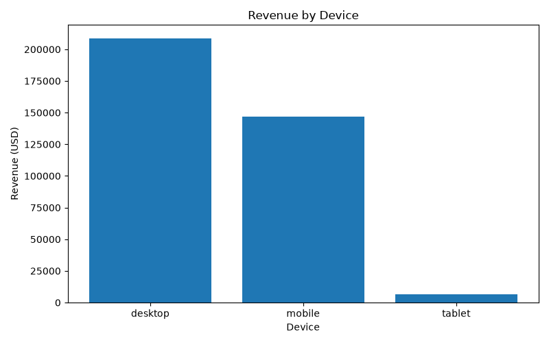

# GA4 Business Analytics

An end-to-end business analytics project built with the Google Analytics 4 (GA4) public ecommerce dataset. It turns raw, event-level ecommerce data into SQL analysis, reusable CSV outputs, visualizations, and an interactive Streamlit dashboard.

## Project goals

- Understand customer behaviour and purchasing activity.
- Measure revenue, sessions, orders, and conversion performance.
- Identify purchasing-funnel drop-off points.
- Evaluate product, acquisition-channel, and device performance.
- Turn findings into practical business recommendations.

## Dashboard

The Streamlit dashboard presents:

- Core business KPIs: users, sessions, orders, revenue, average order value, and session conversion rate.
- Monthly revenue trend.
- Revenue by acquisition source and device category.
- Top products by revenue and units sold.
- Customer purchasing funnel: Sessions → Product View → Add to Cart → Purchasing Users.
- Business insights for revenue, customers, devices, and acquisition performance.

## Key insights

- Desktop is the highest-revenue device category; mobile is the next largest opportunity for conversion and experience improvements.
- Google is the strongest acquisition source by revenue in the dashboard output.
- The funnel falls from 267,116 sessions to 61,252 product views, then 12,545 cart users, and 4,419 purchasing users. Product discovery and cart progression are the main conversion opportunities.
- High-revenue products should be prioritised in campaigns, merchandising, and inventory planning.

> **Metric note:** `Total Orders` and `Purchasing Users` are different measures. One customer can place more than one order, so the order total can be higher than the number of purchasing users.

## Tech stack

- Google BigQuery and SQL
- Python
- Pandas and NumPy
- Matplotlib and Plotly
- Streamlit

## Project structure

```text
ga4-business-analytics/
├── dashboard/
│   └── app.py                       # Streamlit dashboard
├── data/
│   ├── business_kpis.csv
│   ├── business_metrics.csv
│   ├── monthly_revenue.csv
│   ├── source_performance.csv
│   ├── revenue_by_device.csv
│   ├── top_products.csv
│   └── funnel_data.csv
├── docs/
│   ├── 01_business_understanding.md
│   ├── 02_Data_Understanding.md
│   └── 03_Business_Insights.md
├── python/
│   ├── bigquery_connection.py
│   ├── ga4_analysis.py
│   └── visualisation.py
├── screenshots/
│   ├── monthly_revenue_trend.png
│   ├── acquisition_source_performance.png
│   ├── revenue_by_device.png
│   └── top_products_by_revenue.png
├── sql/
│   ├── 01_data_overview.sql
│   ├── 02_event_analysis.sql
│   ├── 03_customer_analysis.sql
│   ├── 04_funnel_analysis.sql
│   ├── 05_product_analysis.sql
│   ├── 06_revenue_analysis.sql
│   ├── 07_session_analysis.sql
│   ├── 09_Business_analysis.sql
│   └── Data_cleaning.sql
├── requirements.txt
└── README.md
```

## Setup and run

### 1. Clone the repository

```bash
git clone <your-repository-url>
cd ga4-business-analytics
```

### 2. Create and activate a virtual environment

**Windows PowerShell**

```powershell
python -m venv .venv
.\.venv\Scripts\Activate.ps1
```

### 3. Install dependencies

```powershell
python -m pip install -r requirements.txt streamlit
```

### 4. Run the dashboard

```powershell
streamlit run dashboard\app.py
```

Open `http://localhost:8501` in a browser. Keep the terminal running while you use the dashboard. Press `Ctrl + C` in the terminal to stop it.

## BigQuery authentication

The project uses Google Cloud Application Default Credentials (ADC). Credentials are configured locally and are not stored in the repository.

To verify the connection:

```powershell
python python\bigquery_connection.py
```

Never commit service-account keys, credential JSON files, API keys, or other secrets.

## SQL analysis

The SQL folder contains modules for:

- Data overview and event analysis
- Customer and funnel analysis
- Product and revenue analysis
- Session and traffic-source analysis
- Consolidated business analysis and data cleaning

## Recommendations

1. Improve product discovery and product-page engagement to move more sessions into product views.
2. Simplify cart and checkout experiences to reduce funnel drop-off.
3. Prioritise Google and other high-revenue acquisition channels when allocating marketing budget.
4. Maintain the strong desktop experience while improving mobile conversion.
5. Promote high-revenue products and review low-performing products for pricing, placement, or campaign opportunities.

## Screenshots





## Project status

The core analysis, SQL modules, data-quality validation, Python outputs, and Streamlit dashboard are complete. Future enhancements may include customer segmentation, retention/cohort analysis, and a formal data dictionary.
