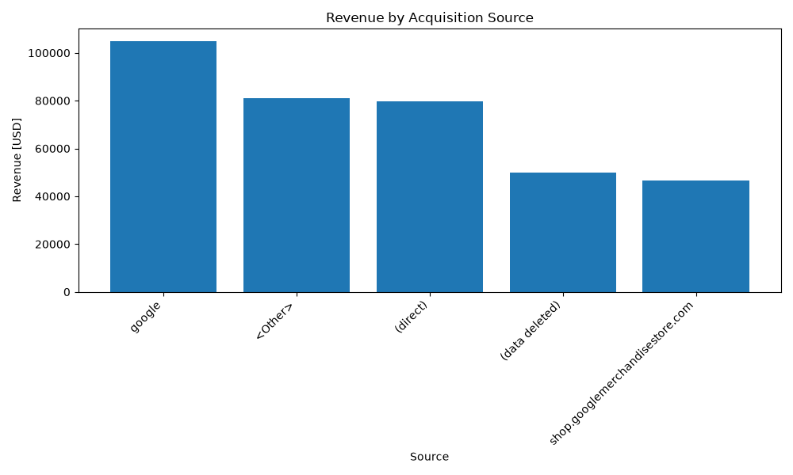
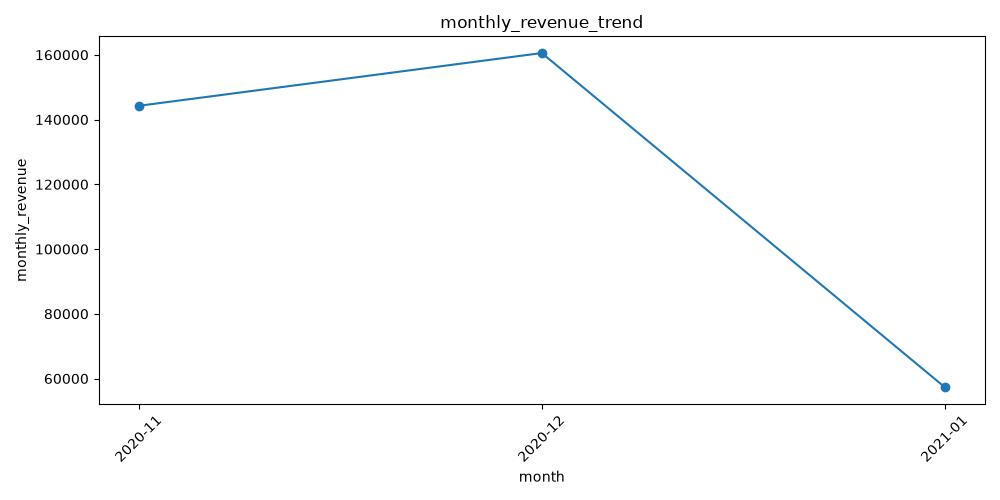
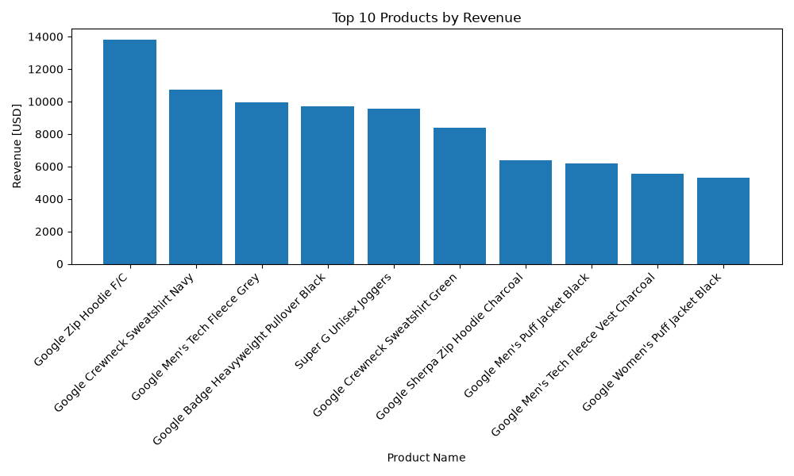

# GA4 Business Analytics

Business Analytics project using the Google Analytics 4 (GA4) public ecommerce dataset.

The project focuses on analyzing customer behavior, purchase funnels, traffic sources, products, and revenue to generate actionable business insights.

## Tech Stack

* SQL (BigQuery)
* Python
* Pandas
* Matplotlib
* Plotly
* NumPy
* SciPy

## BigQuery Authentication

This project uses Google Cloud Application Default Credentials (ADC) to authenticate with BigQuery.

Credentials are configured locally and are **not stored in this repository**.

To verify the BigQuery connection:

```bash
python python/bigquery_connection.py
```

A successful connection will display:

```text
BigQuery connection successful: ga4-business-analytics
```

> **Security:** Never commit service-account keys, credential JSON files, API keys, or other sensitive credentials to GitHub.

## Business Understanding

The business understanding phase defines the business context and analytical direction of the project.

Completed:

- Business scenario
- Business problem
- Stakeholder analysis
- Business objectives
- Success metrics
- KPI framework
- Project scope
- Assumptions
- Business questions

Detailed documentation:

`docs/01_Business_Understanding.md`

## Analysis Completed

### Customer & Funnel Analysis

* Dataset overview analysis
* Customer purchase funnel analysis
* Funnel conversion rate analysis
* Funnel drop-off analysis
* Customer behavior analysis

### Product Analysis

* Product-level analysis
* Top products by revenue

### Traffic & Revenue Analysis

* Traffic source analysis
* Revenue analysis
* Acquisition source performance
* Monthly revenue trend

## Data Visualization

Python-based visualizations have been created using Matplotlib and Plotly.

### Acquisition Source Performance



### Monthly Revenue Trend



### Top Products by Revenue



## Project Structure

```text
ga4-business-analytics/
│
├── python/
│   ├── bigquery_connection.py
│   ├── analysis.py
│   └── visualization.py
│
├── sql/
│   └── ...
│
├── screenshots/
│   ├── acquisition_source_performance.png
│   ├── monthly_revenue_trend.png
│   └── top_products_by_revenue.png
│
├── README.md
└── requirements.txt
```

## Status

**Work in Progress**

### Completed

* BigQuery authentication and connection
* GA4 dataset verification
* Dataset overview analysis
* Customer purchase funnel analysis
* Funnel conversion rate analysis
* Funnel drop-off analysis
* Product-level analysis
* Customer behavior analysis
* Traffic source analysis
* Revenue analysis
* Python-based data visualization
* Acquisition source performance visualization
* Monthly revenue trend visualization
* Top products by revenue visualization

### Next Steps

- Data Understanding
- GA4 schema analysis
- Dataset structure analysis
- Data dictionary
- Data quality checks
- Comprehensive SQL business analytics
- Deeper Python analysis
- Customer segmentation
- Retention and cohort analysis
- Advanced business analytics
- Business insights
- Business recommendations
- Final project documentation
